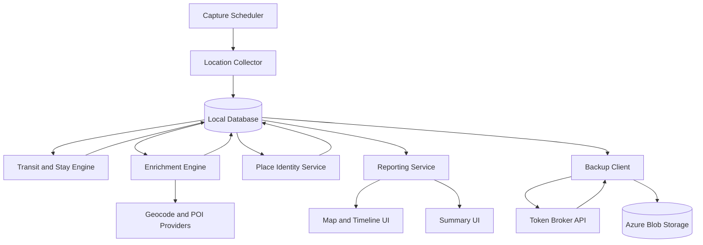

# Architecture and Data Model

## Architecture Overview
The app is a privacy-first, personal Android client with local-first storage and Azure Blob-based backup.

### Components
1. Capture Scheduler
- Triggers location sampling every 30 minutes while tracking is enabled.
- Recovers scheduling after reboot and process death.

2. Location Collector
- Retrieves location sample with accuracy and speed metadata.
- Writes raw sample to local database.

3. Transit and Stay Engine
- Classifies points into transit or stay candidates.
- Uses speed, radius, and dwell-time rules to confirm stays.

4. Enrichment Engine
- Performs automatic reverse geocoding for addresses.
- Performs POI lookup and enriches hotel names when available.
- Applies retry and fallback behavior.

5. Place Identity Service
- Detects recurring stays.
- Proposes labels and stores user-confirmed labels.
- Supports merge and edit flows.

6. Reporting Service
- Produces day/week/month time-spent summaries.
- Excludes transit duration from place totals.

7. Backup Client
- Exports encrypted snapshots and uploads to Azure Blob Storage.
- Restores latest valid snapshot after validation.

8. Token Broker API (lightweight backend)
- Issues short-lived SAS tokens to app.
- Keeps storage account keys server-side only.

## High-Level Flow
1. Scheduler triggers sample capture.
2. Collector stores sample locally.
3. Transit/Stay engine classifies movement state.
4. Enrichment engine resolves address and POI/hotel.
5. Place service updates known places and label suggestions.
6. Reporting service updates aggregate durations.
7. Backup job packages encrypted snapshot and uploads to blob.

## Mermaid Diagram

## Data Model

### Entity: CapturePoint
- id: string (UUID)
- timestampUtc: datetime
- latitude: double
- longitude: double
- accuracyMeters: float
- speedKmh: float nullable
- motionState: enum {unknown, stationary, walking, driving}
- source: enum {gps, fused}
- enrichmentStatus: enum {pending, complete, failed}

### Entity: Enrichment
- id: string (UUID)
- capturePointId: string (FK CapturePoint)
- formattedAddress: string nullable
- poiName: string nullable
- poiType: string nullable
- isHotel: boolean
- confidence: float nullable
- provider: string
- providerTimestampUtc: datetime
- status: enum {complete, partial, failed}

### Entity: StaySegment
- id: string (UUID)
- startUtc: datetime
- endUtc: datetime
- centroidLat: double
- centroidLng: double
- radiusMeters: float
- durationMinutes: int
- classification: enum {stay, transit}
- confidence: float nullable

### Entity: Place
- id: string (UUID)
- canonicalName: string
- labelType: enum {home, work, friend, family, custom}
- customLabel: string nullable
- defaultAddress: string nullable
- centroidLat: double
- centroidLng: double
- active: boolean
- createdUtc: datetime
- updatedUtc: datetime

### Entity: Visit
- id: string (UUID)
- placeId: string (FK Place)
- staySegmentId: string (FK StaySegment)
- startUtc: datetime
- endUtc: datetime
- durationMinutes: int

### Entity: BackupManifest
- id: string (UUID)
- backupVersion: int
- schemaVersion: int
- createdUtc: datetime
- snapshotBlobPath: string
- checksumSha256: string
- encrypted: boolean
- appVersion: string

## Key Rules
1. A driving capture is stored, but does not open a stay.
2. Stay requires minimum dwell time and low-movement clustering.
3. Transit duration is never added to place totals.
4. Address enrichment is mandatory best effort.
5. POI/hotel enrichment is mandatory best effort with address fallback.
6. No sharing module or outbound social data paths in v1.
7. Blob access requires short-lived SAS token from token broker.

## Suggested Initial Thresholds
- Transit threshold: speed > 15 km/h.
- Stay radius: 120 m.
- Minimum dwell: 10 minutes.
- Stay confidence boost: 2 consecutive low-movement captures.

## Backup Sequence
1. Create snapshot from local db state.
2. Encrypt snapshot on device.
3. Request SAS token from token broker.
4. Upload blob with checksum metadata.
5. Write local backup manifest entry.
6. On restore, fetch latest valid manifest, download, validate checksum, decrypt, import.

## Operational Notes
- Keep app local-first for resilience during no-network periods.
- Queue enrichment and backup operations for retry when network is available.
- Maintain schema migrations to preserve restore compatibility.
